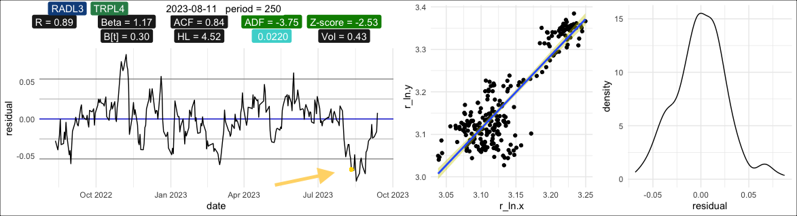
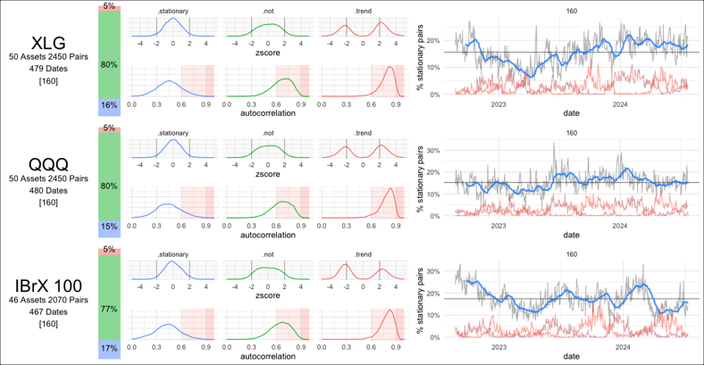

<!--
*** Thanks for checking out the repository. If you have a suggestion
*** that would make this better, please fork the repo and create a pull request
*** or simply open an issue with the tag "enhancement".
*** Don't forget to give the project a star!
*** Thanks again! 
-->

<!-- PROJECT LOGO -->
 

  

  <h3 align="center">Quantitative Metrics Applied to Financial Markets</h3>

  

    Unveiling financial realities through Econometric studies!
     
    <a href="https://github.com/l1m40/QuantMetricMarketInsights/blob/main/docs/Data%20Science.pdf">Statistics</a>
    <a href="https://github.com/l1m40/QuantMetricMarketInsights/blob/main/docs/Data%20Science.pdf">Data Science</a>
    <a href="https://github.com/l1m40/QuantMetricMarketInsights/blob/main/docs/Data%20Science.pdf">Cointegration</a>
    
<!--
    <a href="https://github.com/othneildrew/Best-README-Template"><strong>Explore the docs »</strong></a>
     
     
    <a href="https://github.com/othneildrew/Best-README-Template">View Demo</a>
    ·
    <a href="https://github.com/othneildrew/Best-README-Template/issues">Report Bug</a>
    ·
    <a href="https://github.com/othneildrew/Best-README-Template/issues">Request Feature</a>
-->
  

  
  

<!-- TABLE OF CONTENTS -->

  
Table of Contents

  <ol>
    <li>
      <a href="#about-the-project">About The Project</a>
      <ul>
        <li><a href="#built-with">Built With</a></li>
      </ul>
    </li>
    <li><a href="#getting-started">Getting Started</a></li>
    <li><a href="#usage">Usage</a></li>
<!--
    <li>
      <a href="#getting-started">Getting Started</a>
      <ul>
        <li><a href="#prerequisites">Prerequisites</a></li>
        <li><a href="#installation">Installation</a></li>
      </ul>
    </li>
    <li><a href="#roadmap">Roadmap</a></li>
    <li><a href="#contributing">Contributing</a></li>
    <li><a href="#license">License</a></li>
    <li><a href="#contact">Contact</a></li>
    <li><a href="#acknowledgments">Acknowledgments</a></li>
-->
  </ol>

<!-- PROJECT SHIELDS -->
<!--
*** I'm using markdown "reference style" links for readability.
*** Reference links are enclosed in brackets [ ] instead of parentheses ( ).
*** See the bottom of this document for the declaration of the reference variables
*** for contributors-url, forks-url, etc. This is an optional, concise syntax you may use.
*** https://www.markdownguide.org/basic-syntax/#reference-style-links
-->
<!--
[![Contributors][contributors-shield]][contributors-url]
[![Forks][forks-shield]][forks-url]
[![Stargazers][stars-shield]][stars-url]
[![Issues][issues-shield]][issues-url]
[![MIT License][license-shield]][license-url]

[![Issues][issues-shield]][issues-url]
[![LinkedIn][linkedin-shield]][linkedin-url]
-->

<!-- ABOUT THE PROJECT -->
## About The Project

[![Product Name Screen Shot][product-screenshot]](https://example.com)

This repository focuses on the development and application of quantitative metrics to analyze and trade financial markets. The primary objective is to leverage statistical methods, econometrics, and machine learning techniques to optimize trading strategies and enhance portfolio performance.

The core of this project revolves around cointegration-based pair trading, a market-neutral strategy that identifies price relationships between pairs of stocks. By applying statistical arbitrage techniques, the system generates entry and exit signals based on deviations from the mean, measured through z-scores. Additionally, the project incorporates extensive backtesting using historical data to validate the performance of these strategies.

Key Features:

	•	Cointegration Analysis: Detect pairs of stocks with long-term equilibrium relationships and generate trading signals when they diverge.
	•	Z-Score Modeling: Identify profitable entry and exit points using z-scores, with thresholds set at 2 standard deviations.
	•	Backtesting: Test strategies over a decade of historical data to evaluate performance, including metrics such as Sharpe Ratio, Profit, and Drawdown.
	•	Machine Learning: Apply data mining techniques to optimize trade execution and pattern recognition in historical market data.
	•	Performance Dashboards: Visualize live and backtested results, including key quantitative metrics, using interactive dashboards.

Tools & Technologies:

	•	R and Python: For statistical analysis, backtesting, and data visualization.
	•	Shiny: To build interactive performance dashboards.
	•	Machine Learning Libraries: For optimizing strategies and improving predictive accuracy.
	•	Econometrics: Applying models to test for cointegration and assess trading performance.

This project is designed for financial analysts, quantitative researchers, and developers interested in applying quantitative finance techniques to real-world markets.

Use the `BLANK_README.md` to get started.

(<a href="#readme-top">back to top</a>)

<!-- USAGE EXAMPLES -->
## Usage

Use this space to show useful examples of how a project can be used. Additional screenshots, code examples and demos work well in this space. You may also link to more resources.

cointegration_lab.py

  sample_explore_residuals_CDSET()

_For more examples, please refer to the [Documentation](https://example.com)_

(<a href="#readme-top">back to top</a>)

